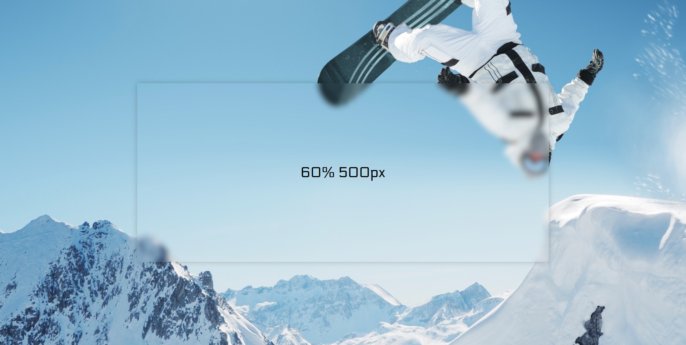

# Frosted Panel

Frosted Panel  is a cross-browser compatible library written in pure Javascript to achieve a responsive "Frosted Glass" effect.

If you are trying to get the same effect [documented here](https://webdesign.tutsplus.com/tutorials/how-to-create-a-frosted-glass-effect-in-css--cms-32535), but need it to work on as many browsers as possible, even if they do not support `filter: blur()`, then Frosted Panel is the library for you.

Check out the [live demo](https://cryptodescriptor.github.io/frosted-panel) so you can see a demonstration of what it looks like. Try re-sizing the browser to see the panels responsiveness.

Browsers tested thus far:

- Chrome
- Firefox
- Edge
- Internet Explorer
- Safari 12 (other versions might work)

Although only a few browsers are listed above, it should work on the majority of them, including Safari and Opera Mini etc.. (Currently untested so do not take my word for it).

## Getting Started

To get started, you will need to fork this repository or [download as zip](https://github.com/cryptodescriptor/frosted-panel/archive/master.zip).

## Configuration
 
Firstly, you will need to select the background-image you want to use. Frosted Panel now scales the image using `background-size: cover` as of BETA_v1.1, therefore the image size is no longer as relevant, we just recommend sizing to be at least `1920x1080` for optimal quality. You may wish to go even larger if you want it to look crisp on 4k monitors, but it will scale nonetheless.

Now that you know what image you will be using, you must specify the path inside `index.html` on the attribute `xlink:href` of the `image` element. Please also change the `width` and `height` attributes to match the dimensions of your image. If you are using an image of `2880x1620` pixels, the `width` should have a value of `2880` and the `height` should have a value of `1620`.

    <image xlink:href="./img/bg.jpg" x="0" y="0" width="2880" height="1620" />

## Attributes

Now you have your background-image all set up, you need to configure the panel size, its margins, and optionally add some breakpoints to allow you to change the sizing on different viewports.

For simplicity, Frosted Panel is configured using html attributes only.

## Width & Height

To set the `width` and `height` of the panel, you need to set the `panel-dimensions` attribute on the div with the class `frosted-panel`.

    

The `width` is the first value, and the `height` is the second value, **the two values should be delimited by a single space**.

Values can be one of three types: `px`, `%`, `auto`:

|Type| Description |
|--|--|
| px | Fixed size in pixels |
| % | Percentage of viewport width or height |
| auto | Auto width or height based on content size |

## Content & Content Margin

All the content that you wish to be inside the panel, must be nested within the `content` div. If you want to control the margin around the content (the space between the content and the edge of the panel), then you must do so by setting `content-margin` attribute on the `div`, with a pixel value. If this attribute is missing or empty, then the margin will default to 0.

    

## Appending Content
If you plan to append content to the panel programmatically, after you do so, you will need to call:

    frostedPanel.pan_and_zoom()
    
To re-calculate the `width` and `height` if they are set to `auto`.

## Panel Margin

On the `body` tag, you can add an optional attribute `space-top-bot`, which works by setting `min-height` on the body to a value of `panel_height + (space-top-bot*2)`, every time the screen is resized. This allows us to emulate a top and bottom `margin` for our panel. Currently there is no way to set a left and right margin, I didn't add this feature because generally you will be using percentage width's for your panel anyway.

If you do use fixed width's, make sure the panel `width` is small enough to fit on the viewport's of your website visitors, otherwise the panel will overflow the body.

    <body space-top-bot="50px">

The above code will add 50px top margin and 50px bottom margin.

## Blur Amount (stdDeviation)
To adjust the "blurryness" of the panel, you will need to change the value of  `stdDeviation` attribute (nested inside the `filter` element of the `svg`). The higher the number, the more blurry your panel will be.

    <feGaussianBlur in="SourceGraphic" stdDeviation="7" />

## Breakpoints

You can configure the panel to be different sizes at different viewport width's using the `breakpoints` attribute in conjunction with `breakpoint-type` attribute.

You should be familiar with CSS media queries that make use of `min-width` and `max-width` conditions to apply a set of styles at certain viewport width's (breakpoints).

Frosted Panel gives you freedom of choice by allowing you to provide `breakpoint-type` attribute, with a value of either `min-width` (mobile first), or `max-width`. The performance impact will be exactly the same for both, just use the one you feel the most comfortable with.

Example:

    

Great! Now you have selected which media query type you will be using, you can start to tell Frosted Panel how big you want it to be at different viewport width's.

You do this by passing a list of breakpoints to the `breakpoints` attribute, each delimited by a single comma `,`.

Each breakpoint must follow a specific format. The first value is the `width` in pixels that you want the breakpoint to occur at (must end with "`px`"), the second and third values are `width` and `height` values which determine the size of the panel when the breakpoint is triggered. The `width` and `height` value's each can be one of three format's described in the "Width & Height" section.

Examples:

    

The CSS equivalent of the above would be:

    .frosted-panel {
      width: auto;
      height: auto;
    }
    
    @media only screen and (min-width: 600px) {
      .frosted-panel {
        width: 70%;
        height: 300px;
      }
    }
    
    @media only screen and (min-width: 1200px) {
      .frosted-panel {
        width: 60%;
        height: 500px;
      }
    }

When `breakpoint-type` is changed from `min-width` to `max-width`, the CSS equivalent would now be this:
 
    .frosted-panel {
      width: auto;
      height: auto;
    }
    
    @media only screen and (max-width: 1200px) {
      .frosted-panel {
        width: 60%;
        height: 500px;
      }
    }
    
    @media only screen and (max-width: 600px) {
      .frosted-panel {
        width: 70%;
        height: 300px;
      }
    }

With `min-width`, the frosted-panel would have a `width` and `height` of `auto` when the viewport is < `600px`. If the viewport width was between `600px` and `1200px` the panel `width` would be `70%`, and the panel `height` would be `300px`. And if the viewport `width` was > `1200px` then the panel `width` would be `60%` and the panel `height` would be `500px`.

Whereas, if we used `max-width` instead, and the viewport was < `600px`, then the frosted-panel would have a `width` of `70%` and a `height` of `300px`. If the viewport was between `600px` and `1200px`, then the panel `width` would be `60%`, and the panel `height` would be `500px`. If the viewport was any larger than `1200px` then the panel `width` and `height` would both be set to `auto`.

As you can see, the breakpoint attributes emulate standard CSS media queries. And are mandatory if you wish to use media queries to control the size of Frosted Panel.
